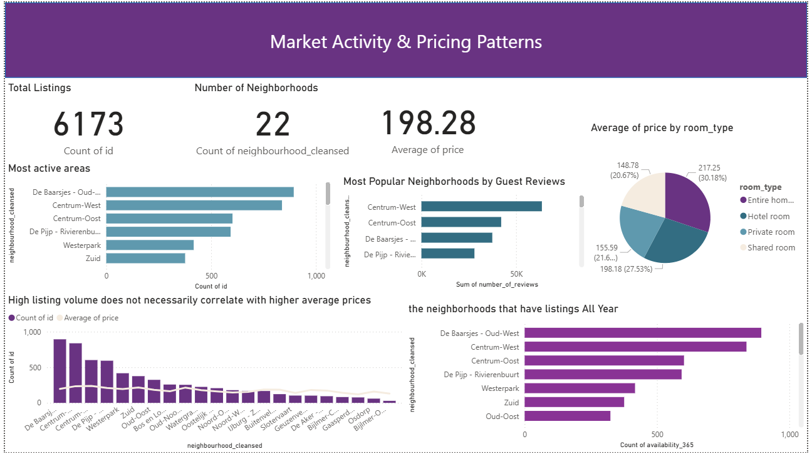
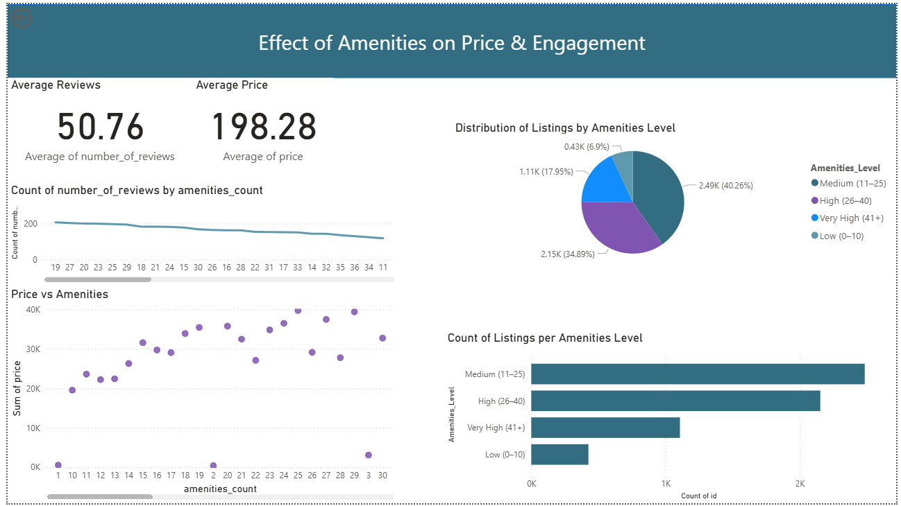

# Airbnb Market Analysis Dashboard

## Project Overview

This project analyzes Airbnb listing data to understand market activity, pricing patterns, and the impact of amenities on price and guest engagement.
The analysis was performed using SQL for data analysis and Power BI for data visualization.

The dashboard helps answer important business questions about pricing, neighborhoods, room types, and amenities.

---

## Tools Used

* SQL – Data cleaning and analysis
* Power BI – Dashboard and data visualization
* Excel / CSV – Dataset

---

## Dashboard Preview

### 1. Market Activity & Pricing Patterns

**Insights:**

* Total Listings: 6,173
* Number of Neighborhoods: 22
* Average Price: 198
* Entire homes have the highest average price.
* High listing volume does not always mean higher prices.
* Some neighborhoods have listings available all year.

**Charts:**

* Most active areas
* Most popular neighborhoods by reviews
* Average price by room type
* Listing volume vs average price
* Listings available all year

---

### 2. Effect of Amenities on Price & Engagement

**Insights:**

* Average Reviews: 50.76
* Average Price: 198
* More amenities lead to higher price.
* Medium and High amenities listings are the most common.
* Very high amenities listings are fewer but more expensive.

**Charts:**

* Reviews vs amenities count
* Price vs amenities
* Distribution of listings by amenities level
* Count of listings per amenities level

---

## Business Questions Answered

This project answers the following questions:

1. Which neighborhoods have the most listings?
2. Which neighborhoods are most popular based on reviews?
3. Which room type has the highest average price?
4. Does higher listing volume mean higher prices?
5. How do amenities affect price?
6. How do amenities affect customer engagement?
7. Which neighborhoods have listings available all year?

---

## Project Files

| File Name             | Description           |
| --------------------- | --------------------- |
| Airbnb_Dashboard.pbix | Power BI Dashboard    |
| dataset.csv           | Dataset               |
| Market_Activity.png   | Dashboard Page 1      |
| Effect_on_Price.png   | Dashboard Page 2      |
| README.md             | Project Documentation |

---

## Skills Demonstrated

* Data Cleaning
* Exploratory Data Analysis (EDA)
* SQL Analysis
* Data Visualization
* Dashboard Design
* Business Analysis
* Data Storytelling

---

## Conclusion

The analysis shows that price is influenced by room type, location, and amenities, while customer engagement (reviews) is affected by amenities and neighborhood popularity.
This helps Airbnb hosts make better decisions about pricing and improving their listings.

---

## Author

Nada Said
Junior Data Analyst
Skills: SQL | Power BI | Excel | Python

---

## How to Use

1. Download the .pbix file
2. Open using Power BI Desktop
3. Interact with filters and charts
